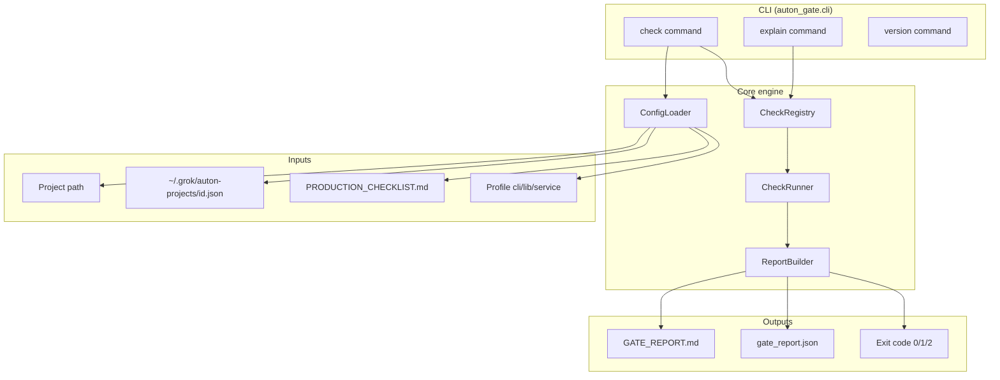

# Design: First `/autonomous` Test Project Identification + `auton-gate`

## Title & Metadata

| Field | Value |
|-------|--------|
| **Document** | Full-lifecycle design (meta identification run + recommended deliverable) |
| **AUTON_ID** | `ee70444d` |
| **Slug** | `identify-first-auton-test-project` |
| **Recommended test project** | `auton-gate` (slug: `auton-gate`) |
| **Status** | Revised (post design review) |
| **Plan** | `/tmp/grok-auton-artifacts-ee70444d/PLAN.md` |
| **Date** | 2026-06-03 (PT) |
| **Device** | Washington (Linux) |
| **Author** | Design phase (design-doc-writer persona) |
| **Related** | `~/.grok/auton-projects/ee70444d.json`, `/tmp/grok-auton-artifacts-ee70444d/RESEARCH_SYNTHESIS.md` |
| **Canonical gate** | `~/.grok/skills/autonomous/docs/PRODUCTION_CHECKLIST.md` (136 lines, 12 sections) |
| **Orchestrator** | `~/.grok/skills/autonomous/SKILL.md` (Phase 6 = Harden & Verify) |

---

## Overview

This design covers **two coupled deliverables** as one coherent program:

1. **Meta identification run (`ee70444d`)** — Complete the autonomous phases for *choosing and specifying* the first greenfield `/autonomous` functional test: research (done), design (this document), plan extraction, bootstrap of the **next** run’s starter artifacts, handoff to Mempalace/Hermes, symbiosis doc touchpoints, and production gate for *this* run’s artifacts (synthesis, design, plan, `PRODUCTION_READY.md` for the identification outcome—not shipping `auton-gate` code in this run unless scope explicitly expands).

2. **`auton-gate` (recommended first test project)** — A **standalone Python CLI** that **mechanically executes** the automatable portions of `PRODUCTION_CHECKLIST.md` against an arbitrary project workspace (and optionally links `~/.grok/auton-projects/<AUTON_ID>.json`), emitting structured **`VERDICT: PASS|FAIL`**, `GATE_REPORT.md`, and `gate_report.json`, with exit codes suitable for CI and Phase 6 loops.

The identification run’s **product outcome** is a vetted recommendation plus **implementation-ready** design and PR DAG so a **separate** `/autonomous` invocation can build `~/auton-gate` (or `~/Projects/auton-gate`) to completion with higher Phase 6 PASS reliability for all future projects.

---

## Background & Motivation

### Symbiosis and the autonomous orchestrator

The `/autonomous` skill (`SKILL.md:39–55`) defines an immutable pipeline ending in **Phase 6: Harden & Verify (Production Gate)** and **Phase 9: Persistent Handoff**. Exit is contractually **only** on production gate **PASS** or a true external block (`SKILL.md:57`, `:231`).

Today the gate is **documentation + LLM verifier subagent** (`PRODUCTION_CHECKLIST.md:116–127`): the verifier must re-read state, re-run commands, and mark 80+ checkboxes with evidence. There is **no reusable executable verifier** for arbitrary repos:

| Mechanism | Limitation |
|-----------|------------|
| `PRODUCTION_CHECKLIST.md` | Human/LLM adjudication only |
| `micro-autonomous-test.py` | Temp toy workspace (~7 checks), not sections 1–12 on real trees |
| `verify-skill-structure.py` | Skill meta only |
| `/check-work` | Session-scoped; different scope than full prod checklist |

Research (`RESEARCH_SYNTHESIS.md` §2.4–2.5) identifies **gate friction** as the highest-leverage complement: Phase 6 is **LLM-only**, non-deterministic, costly, and produces no CI-enforceable artifact. Prior toolbox autonomous runs (`6370a6d6`, `df604e5f`) proved the orchestrator works in prose but did not add **project-level** mechanical verification.

Ecosystem precedents (`check-primes.sh`, `relay-health.sh`, `vet-tool.sh`) show **fail-closed exit codes + structured sections**—none map 1:1 to `PRODUCTION_CHECKLIST.md` for arbitrary projects.

### User constraint for `ee70444d`

The original idea (`ee70444d.json:3–4`): identify a **first test project** for `/autonomous` that is **not** any current incumbent repo and may **complement** reliable completion of ongoing work. Research **confirms** `artifacts.recommended_project: auton-gate` (`ee70444d.json:28–29`, `DECISION-001` in `KEY_DECISIONS.log`).

### Symbiosis operational context

Tier-1 focus remains Real Slack / relay (`linux-instructions.md` per synthesis §4.1). **`auton-gate` has no Slack/Pi dependency**—local CLI only—so it does not compete with relay token work.

---

## Goals & Non-Goals

### Goals — meta identification run (`ee70444d`)

| ID | Goal |
|----|------|
| G-M1 | Produce **actionable** `DESIGN.md` + `PLAN.md` + `DESIGN_SUMMARY.md` under `/tmp/grok-auton-artifacts-ee70444d/`. |
| G-M2 | Record **winner + runner-up**, exclude list, risks, and **KEY_DECISIONS** continuity. |
| G-M3 | Define **bootstrap package** for the *next* `/autonomous` run: embedded plan stub, suggested prompt (synthesis §11), repo path, Mempalace drawer `projects/auton-gate`, Hermes handoff notes. |
| G-M4 | Pass **this run’s** production gate for *documentation deliverables* (research synthesis, design, plan, `PRODUCTION_READY.md` describing recommendation—not unbuilt `auton-gate` binary). |
| G-M5 | Update symbiosis coordination **lightly** post-PASS (optional Kumquat mention of `auton-gate` in linux/windows instructions). |

### Non-Goals — meta identification run

| ID | Non-Goal |
|----|----------|
| NG-M1 | Implement full `auton-gate` source in `ee70444d` (unless user explicitly merges scope). |
| NG-M2 | Modify incumbent repos (openclaw, grok-hermes-symbiosis, GrokForge, etc.). |
| NG-M3 | Build `auton-eval-harness`, kanban auto-setup, or meta bust-a-nut dashboard (deferred per `DECISION-004`). |

### Goals — `auton-gate` MVP (next autonomous run)

| ID | Goal |
|----|------|
| G-A1 | `auton-gate check <PATH>` with **exit 0 = no mechanical FAIL**, **exit 1 = mechanical FAIL** (does **not** equal autonomous production-ready; see § Verdict semantics). |
| G-A2 | Map automatable checks to stable **`check_id`** slugs tied to checklist §N bullet index (Appendix A); evidence in report. |
| G-A3 | `--auton-id` loads `~/.grok/auton-projects/<id>.json` for artifact paths (research, design, `PRODUCTION_READY.md`). |
| G-A4 | `--profile cli|lib|service` documents tailoring per `PRODUCTION_CHECKLIST.md:125–126`. |
| G-A5 | `auton-gate explain <check-id>` for remediation hints. |
| G-A6 | **Self-dogfood**: `pip install -e . && auton-gate check .` passes on the `auton-gate` repo after implementation. |
| G-A7 | `pytest` + fixture repos; **GitHub Actions** CI (lint + test). |
| G-A8 | README integration section for **Phase 6** invocation before verifier subagent. |

### Non-Goals — `auton-gate` MVP

| ID | Non-Goal |
|----|----------|
| NG-A1 | Replace verifier subagent entirely—**adjudicate `MANUAL_REVIEW_REQUIRED`** items only. |
| NG-A2 | Paid hosting, deploy smoke for services (profile `cli` default). |
| NG-A3 | Full Hermes kanban automation (post-MVP). |
| NG-A4 | False PASS on ambiguous heuristics—strict on **build / test / secrets** (`RISK-001` mitigation). |
| NG-A5 | `auton-scaffold` (sequenced **after** `auton-gate` per `DECISION-002`). |

---

## Proposed Design: `auton-gate`

### Architecture (logical)



### Module layout (target repo `~/auton-gate`)

```
auton-gate/
├── pyproject.toml
├── README.md
├── AGENTS.md
├── CHANGELOG.md
├── .github/workflows/ci.yml
├── src/auton_gate/
│   ├── __init__.py
│   ├── cli.py              # entry: auton-gate
│   ├── config.py           # paths, profile, auton state merge
│   ├── checklist.py        # parse section IDs from canonical MD (metadata only)
│   ├── detector.py         # lang/stack: pyproject.toml, package.json, Cargo.toml, ...
│   ├── registry.py         # register checks by section_id
│   ├── runner.py           # parallel/sequential execution, timeouts
│   ├── reporter.py         # GATE_REPORT.md + gate_report.json
│   ├── logging_conf.py     # structured stderr logs
│   └── checks/
│       ├── base.py         # CheckResult, Status enum
│       ├── s03_build_lint.py
│       ├── s04_tests.py
│       ├── s05_secrets.py
│       ├── s06_ci.py
│       ├── s07_readme.py
│       ├── s08_lockfiles.py
│       ├── s11_git_clean.py
│       └── s12_handoff.py    # PRODUCTION_READY.md, auton artifacts
├── tests/
│   ├── test_cli.py
│   ├── test_registry.py
│   └── fixtures/
│       ├── good_cli_py/
│       └── bad_missing_tests/
└── docs/
    └── INTEGRATION_AUTONOMOUS.md
```

### Check registry model

Each check implements:

- `section`: checklist `## N.` number (1–12)
- `bullet`: 1-based index within that section’s `- [ ]` list (see **Appendix A**)
- `check_id`: stable slug `{section:02d}.{bullet:02d}.{short_name}` e.g. `s03.03.build_clean`, `s04.05.test_suite` (parsed from canonical MD in `checklist.py` for labels; IDs are normative in Appendix A)
- `automatable`: `full` | `partial` | `manual`
- `run(ctx) -> CheckResult` with `status`: `PASS` | `FAIL` | `SKIP` | `MANUAL_REVIEW_REQUIRED`
- `evidence`: command output excerpt (truncated), file paths, counts

**PR 3 gate:** Do not merge check modules until **Appendix A** is committed in `docs/CHECKLIST_MAPPING_v1.md` (generated from same source as design appendix).

### Verdict semantics (mechanical vs production-ready) — **normative**

`auton-gate` implements a **mechanical gate only**. It does **not** satisfy `SKILL.md:231` or `USAGE.md:48–51` by itself. **Production ready** requires the **verifier subagent** (or human) to output **`VERDICT: PASS`** on the **full** `PRODUCTION_CHECKLIST.md` after adjudicating all applicable items.

| Layer | Meaning |
|-------|---------|
| **Mechanical `VERDICT`** | Emitted by `auton-gate` in `GATE_REPORT.md` / JSON |
| **Production `VERDICT`** | Emitted only by verifier subagent in Phase 6 gate report |

**Mechanical aggregation** (honors `PRODUCTION_CHECKLIST.md:127–131` for automatable strict checks):

- Any `FAIL` on **strict** checks (build, test, secrets in repo) → mechanical **`VERDICT: FAIL`**, exit **1**
- No strict `FAIL`, remaining items `MANUAL_REVIEW_REQUIRED` / `SKIP` → mechanical **`VERDICT: MECHANICAL_PASS`**, exit **0** (unless `--strict` → exit **1** if any manual pending)
- Never label mechanical success as “full production PASS” in headers

| Condition | Exit code | Mechanical verdict line in report |
|-----------|-----------|-----------------------------------|
| Any strict FAIL | 1 | `VERDICT: FAIL` |
| No FAIL, manual items remain | 0 (1 if `--strict`) | `VERDICT: MECHANICAL_PASS` |
| All registered checks PASS/SKIP, no FAIL | 0 | `VERDICT: MECHANICAL_PASS` |

**Mandatory report banner** (top of every `GATE_REPORT.md`, before any checkbox list):

```markdown
> **MECHANICAL GATE ONLY** — This report is **not** a substitute for the autonomous verifier `VERDICT: PASS` on the full Production Readiness Checklist (`PRODUCTION_CHECKLIST.md`). Phase 6 succeeds only when the verifier subagent declares production `VERDICT: PASS` with evidence for all applicable items.
```

Orchestrator rule (also in `docs/INTEGRATION_AUTONOMOUS.md`, PR 10): **Do not** advance to Phase 7 or declare “production ready” on `auton-gate` exit 0 alone.

### Language / stack detector

Order of precedence for command discovery:

1. `pyproject.toml` → `ruff check`, `pytest` (or `[tool.auton-gate]` overrides in pyproject optional v2)
2. `package.json` → `npm test`, `npm run lint` if scripts exist
3. `Cargo.toml` → `cargo test`, `cargo clippy`
4. `Makefile` → `make test`, `make lint` if targets exist
5. Fallback: record `MANUAL_REVIEW_REQUIRED` for §3–4 with evidence “no known manifest”

Detector writes `detected_stack` into `gate_report.json` for Hermes/Mempalace ingest.

### Profile skip rules (`config.py`)

| Profile | §1–§2 | §3–§8 | §9 deploy | §10 ops | §11 git | §12 handoff |
|---------|-------|-------|-----------|---------|---------|-------------|
| **cli** (default) | always `MANUAL_REVIEW_REQUIRED` | run registered checks | **SKIP** (tailored) | stderr logging only; §10.01–10.05 **SKIP**; §10.06–10.07 **MANUAL** | run partial | run partial + `--auton-id` |
| **lib** | manual | run + emphasize §7 README, §8 lockfiles | **SKIP** | partial MANUAL | run | run |
| **service** | manual | run | **MANUAL** v1 (stubs); §9 **v2** | **MANUAL** v1 | run | run |

§1–§2 are **never** fully automatable in v1 (design/research quality). §9–§10 full automation deferred to v2 for `service` profile.

### Integration with autonomous phases

| Phase | Behavior |
|-------|----------|
| **6** | Run **Phase 6 ordered subroutine** (below); loop fixes until mechanical exit 0 **and** verifier production `VERDICT: PASS` |
| **9** | Attach `GATE_REPORT.md` + verifier gate report paths in `PRODUCTION_READY.md` |
| **10** | File pattern to `projects/auton-gate` drawer; skill doc patch per E-1 |

#### Phase 6 ordered subroutine (normative)

Supplements `SKILL.md:47–51` and `PRODUCTION_CHECKLIST.md:116–119`. **`auton-gate` supplements** command re-runs; the verifier **still** must execute build/test/lint itself for production PASS (trust-but-verify), using `GATE_REPORT.md` as evidence to avoid redundant failure modes.

| Step | Action | Owner |
|------|--------|-------|
| 6.1 | `auton-gate check "$REPO_ROOT" --auton-id "$AUTON_ID" --checklist ~/.grok/skills/autonomous/docs/PRODUCTION_CHECKLIST.md --profile <cli\|lib\|service>` | Orchestrator |
| 6.2 | If exit **1**: fix loop (implementer) → repeat 6.1 until mechanical exit **0** | Orchestrator |
| 6.3 | Persist `artifacts.gate_report_md`, `artifacts.gate_report_json` in `~/.grok/auton-projects/<id>.json` (orchestrator write-back; gate binary read-only) | Orchestrator |
| 6.4 | `/check-work` on session-scoped gaps if applicable (does not replace checklist) | Orchestrator |
| 6.5 | **security-auditor** persona for §5 items marked `MANUAL_REVIEW_REQUIRED` / full §5 on high-risk projects | Subagent |
| 6.6 | **Verifier subagent**: read state, synthesis, design, plan, both reports; re-run commands per checklist L118; mark every applicable item; output production gate report with **`VERDICT: PASS` or `FAIL`** | Subagent |
| 6.7 | If verifier **FAIL**: fix loop → return to 6.1 | Orchestrator |

**E-1 default path:** Patch canonical `~/.grok/skills/autonomous/SKILL.md` L47–51 to reference steps 6.1–6.6. Symbiosis mirror (`grok-hermes-symbiosis`) updated on **Kumquat** per checklist footer L135 / `MIRROR_KITS`—not blocking MVP.

Full prose for implementers: `docs/INTEGRATION_AUTONOMOUS.md` (PR 10), duplicated in PLAN task B-10.

---

## Meta Deliverables Design (identification run `ee70444d`)

### Artifact tree (this workspace)

| Artifact | Path | Purpose |
|----------|------|---------|
| Research synthesis | `/tmp/grok-auton-artifacts-ee70444d/RESEARCH_SYNTHESIS.md` | Done; 16+ sources |
| Key decisions | `/tmp/grok-auton-artifacts-ee70444d/KEY_DECISIONS.log` | Audit trail |
| Design (this doc) | `/tmp/grok-auton-artifacts-ee70444d/DESIGN.md` | Full design |
| Design summary | `/tmp/grok-auton-artifacts-ee70444d/DESIGN_SUMMARY.md` | Executive handoff |
| Plan | `/tmp/grok-auton-artifacts-ee70444d/PLAN.md` | Extracted in Phase 3/4 (DAG + tasks) |
| Bootstrap starter | `/tmp/grok-auton-artifacts-ee70444d/starter-auton-gate/` | Optional minimal tree: `PLAN.md`, `DESIGN_EXCERPT.md`, `.auton-starter.json` |
| Production ready (meta) | `/tmp/grok-auton-artifacts-ee70444d/PRODUCTION_READY.md` | Verdict for *identification* deliverables |
| Gate report (meta) | `/tmp/grok-auton-artifacts-ee70444d/GATE_REPORT.md` | Phase 6 for ee70444d |

### State file updates (`~/.grok/auton-projects/ee70444d.json`)

After design/plan:

- `current_phase` → `phase-4-bootstrap` or `phase-5-execute` per orchestrator
- `design_doc_path`, `plan_path` populated (already stubbed `:13–14`)
- `artifacts.next_autonomous_prompt` = synthesis §11 text
- `artifacts.target_repo` = `~/auton-gate`
- `artifacts.starter_path` = starter directory above

### Bootstrap for **next** run (not necessarily in ee70444d execute)

Phase 4 of a **new** `/autonomous` with idea from §11 should:

1. `git init` at `~/auton-gate` (greenfield, outside exclude list)
2. Copy or reference `DESIGN.md` / `PLAN.md` into repo `docs/` or Mempalace-only per user preference
3. Scaffold `pyproject.toml`, `src/auton_gate/`, CI skeleton per PR-1 in PR Plan
4. Set new `AUTON_ID` **or** user continues with dedicated build ID—identification `ee70444d` remains the **decision record**

### Mempalace / Hermes (meta)

| System | Action |
|--------|--------|
| **Mempalace** | Drawer `projects/identify-first-auton-test-project`: index files below (M-4); use `mempalace_update_drawer` / search with paths |
| **Mempalace** | Drawer `projects/auton-gate`: created at start of **build** run; pin checklist path + version |
| **Hermes** | Optional kanban lane “auton-gate build” when build run starts; not blocking for identification PASS |
| **Symbiosis** | Post-build PASS: one-line in `linux-instructions.md` / `windows-instructions.md` pointing to `auton-gate` CLI for Phase 6 |

### Verification — meta run production gate

Meta project type: **documentation / decision deliverable** (no application repo). Tailoring **must** appear in meta `GATE_REPORT.md` per `PRODUCTION_CHECKLIST.md:125–126`.

**Pre–Phase 6 requirement:** `DESIGN_REVIEW.md` shows **0 open Medium/High** issues (design reviewer consensus).

#### Meta gate tailoring matrix (`ee70444d`)

| § | Item scope | Meta status | Evidence path / note |
|---|------------|-------------|----------------------|
| **1** | Requirements & research | **PASS** (verifier) | `RESEARCH_SYNTHESIS.md`, `KEY_DECISIONS.log`, `ee70444d.json` |
| **2** | Design & planning | **PASS** (verifier) | `DESIGN.md`, `PLAN.md`, `DESIGN_REVIEW.md` (0 open Med+), PR Plan in design |
| **3** | Code quality | **N/A** | No product code in meta run (NG-M1) |
| **4** | Testing | **N/A** | No product test suite |
| **5** | Security | **MANUAL** (light) | No secrets in artifact dir; verifier spot-check |
| **6** | CI/CD | **N/A** | Optional; not required for meta PASS |
| **7** | Documentation | **PASS** | `DESIGN_SUMMARY.md`, `PRODUCTION_READY.md` (M-3) |
| **8** | Packaging | **N/A** | No distributable package |
| **9** | Infra & deploy | **N/A** | Explicitly out of scope |
| **10** | Observability | **N/A** | No runtime service |
| **11** | Git hygiene | **MANUAL** | Artifacts in `/tmp/...`; commit optional |
| **12** | Handoff | **PARTIAL PASS** | See below |

**§12 meta specifics (deviation documented):**

| §12 bullet | Meta status | Evidence |
|------------|-------------|----------|
| PRODUCTION_READY.md | **PASS** (M-3) | Verdict + resume + next-build prompt |
| Mempalace indexed | **PASS** (M-4) | Drawer `projects/identify-first-auton-test-project` |
| Hermes kanban live | **N/A (tailored)** | Identification is a decision record, not a shipped product; **build** run creates `projects/auton-gate` kanban (OQ: optional Hermes ping on PASS only) |
| Cross-device instructions | **MANUAL** | M-5 optional one-liner |
| Schedulers | **N/A** | Unless pr-babysit on symbiosis doc PR |
| Owner context | **PASS** | `PRODUCTION_READY.md` + Mempalace drawer |

Hermes kanban is **not** a blocker for meta identification PASS when tailoring is recorded (resolves reviewer Issue 2 vs L281).

---

## API / Interface

### Commands

| Command | Description |
|---------|-------------|
| `auton-gate check PATH` | Run all registered checks for PATH |
| `auton-gate explain CHECK_ID` | Print remediation text + doc links |
| `auton-gate version` | Version + pinned default checklist path + git sha |

### Flags (`check`)

| Argument / flag | Default | Description |
|-----------------|---------|-------------|
| `PATH` (positional) | — | Project root (required); **no** `--path` alias (positional-only CLI) |
| `--auton-id ID` | none | Load `~/.grok/auton-projects/ID.json` |
| `--checklist PATH` | `~/.grok/skills/autonomous/docs/PRODUCTION_CHECKLIST.md` | Canonical checklist reference |
| `--profile {cli,lib,service}` | `cli` | Skip/rules profile |
| `--output-dir DIR` | cwd or `./gate-output` | Write `GATE_REPORT.md`, `gate_report.json` |
| `--format md,json` | both | Output formats |
| `--strict` | false | Exit 1 if any `MANUAL_REVIEW_REQUIRED` |
| `--no-git-check` | false | Skip §11 clean tree |
| `-v` / `--verbose` | false | Structured logs to stderr |
| `--timeout SEC` | 600 per command | Per subprocess cap |

### Exit codes

| Code | Meaning |
|------|---------|
| 0 | Mechanical pass (no strict FAIL); see banner—not production PASS |
| 1 | Mechanical `VERDICT: FAIL` or `--strict` with manual pending |
| 2 | Usage error, missing path, corrupt auton json |

### Report formats

**`GATE_REPORT.md`** — Human + verifier subagent:

```markdown
## Production Readiness Gate Report (auton-gate — mechanical)
> **MECHANICAL GATE ONLY** — Not a substitute for autonomous verifier `VERDICT: PASS` on the full checklist.

**Project**: <slug or dirname>
**AUTON_ID**: <id or N/A>
**Profile**: cli
**Checklist**: <path> (sha256 prefix)
**Date**: ISO8601

### Checklist Status (automated)
- [x] s03.04 Linters — evidence: `ruff check` exit 0
- [ ] s05.01 Security auditor — MANUAL_REVIEW_REQUIRED
...

### Evidence
...

### Manual Review Required
...

**Mechanical verdict:** VERDICT: MECHANICAL_PASS | VERDICT: FAIL
```

**`gate_report.json`** — Machine schema `GATE_REPORT` v1:

```json
{
  "schema_version": "1.0",
  "tool_version": "0.1.0",
  "project_path": "/abs/path",
  "auton_id": "ee70444d",
  "profile": "cli",
  "checklist_path": "/home/.../PRODUCTION_CHECKLIST.md",
  "checklist_sha256": "...",
  "detected_stack": {"primary": "python", "manifest": "pyproject.toml"},
  "started_at": "...",
  "finished_at": "...",
  "checks": [
    {
      "check_id": "s04.05.test_suite",
      "section": 4,
      "bullet": 5,
      "status": "PASS",
      "automatable": "full",
      "evidence": {"command": "pytest -q", "exit_code": 0, "summary": "42 passed"}
    }
  ],
  "mechanical_verdict": "MECHANICAL_PASS",
  "exit_code": 0,
  "production_verdict": null
}
```

(`production_verdict` is set only by verifier subagent in a separate artifact—not by this tool.)

---

## Data Model

### `~/.grok/auton-projects/<id>.json` (read-only for gate)

Fields consumed by `auton-gate` (optional):

| Field | Use |
|-------|-----|
| `auton_id`, `slug` | Report header |
| `research_path` | §1 evidence file exists |
| `design_doc_path` | §2 evidence |
| `plan_path` | §2 PR plan exists |
| `artifacts.workspace` | Optional extra scans |
| `mempalace_drawer` | Document in §12 |
| `prod_gate_state` | Round history (write-back optional v2) |

Gate **does not mutate** state in MVP; orchestrator updates JSON after step 6.3.

**Orchestrator write-back** (after mechanical gate, optional fields under `artifacts`):

```json
{
  "artifacts": {
    "gate_report_md": "/abs/path/GATE_REPORT.md",
    "gate_report_json": "/abs/path/gate_report.json",
    "gate_mechanical_verdict": "MECHANICAL_PASS",
    "gate_checklist_sha256": "...",
    "next_autonomous_prompt": "<synthesis §11 text>",
    "target_repo": "~/auton-gate",
    "starter_path": "/tmp/grok-auton-artifacts-ee70444d/starter-auton-gate"
  },
  "prod_gate_state": {
    "last_mechanical_verdict": "MECHANICAL_PASS",
    "last_production_verdict": "PENDING",
    "round": 1,
    "issues": []
  }
}
```

### Internal types (Python)

- `ProjectContext`: path, profile, auton_state, checklist_path, env
- `CheckResult`: check_id, section_id, status, message, evidence dict, duration_ms
- `GateReport`: aggregate verdict, checks list, metadata

---

## Alternatives Considered

| Alternative | Pros | Cons | Decision |
|-------------|------|------|----------|
| **TypeScript CLI** | npm ecosystem | Diverges from micro-test, toolbox, relay Python tools | **Rejected** (`DECISION-005` Python) |
| **Extend `micro-autonomous-test.py` only** | Already exists | Temp-only, not 12-section mapping | **Rejected**; replace with proper package |
| **Full auto PASS without verifier** | Faster | Violates trust model; false PASS risk | **Rejected**; hybrid manual |
| **Skill-only extension (no repo)** | No new repo | Not a real `/autonomous` greenfield test | **Rejected** for first test |
| **auton-scaffold first** | Helps Phase 4 | Does not fix verify loop | **Runner-up**, sequenced second |
| **auton-state-manager** | Resume UX | Lower leverage on PASS | Deferred |
| **Shell-only `check-primes` clone** | Simple | Weak JSON, hard to test | **Rejected** for core; may wrap as optional |

---

## Security & Privacy

- **No secrets in gate repo**; gate reads project files and runs commands—**.env must not be committed** (check §5).
- Secret scan: regex + known patterns (AWS keys, `sk-`, private keys); never upload project content to network in MVP.
- **Path safety**: resolve `--path` to realpath; refuse to scan paths outside allowed root without `--allow-any-path` (default: warn on `$HOME` outsiders).
- **Subprocess**: no shell injection—use `subprocess` with **argv lists only** (`shell=False`); cwd locked to project root. **Contrast:** legacy `micro-autonomous-test.py` L22 uses `shell=True` for its toy harness; `auton-gate` must **not** follow that pattern (document in README Security section).
- **auton json**: read-only; validate JSON schema minimally; no code execution from state file.
- Scanning user projects is **local-only**; document in README for Oregon mirror trust model.

---

## Observability

- **Structured logging** (stderr): `event=check_start check_id=...`, `event=check_finish status=... duration_ms=...` (JSON lines optional `--log-format json`).
- **Reports** feed Mempalace: attach `gate_report.json` summary to drawer; Hermes gateway can paste `VERDICT` line.
- **Version command** exposes checklist path + hash for drift detection (`RISK-002`).
- Future: OpenTelemetry hook stub in `logging_conf.py` (non-goal MVP).

---

## Rollout / Integration Plan

### Phase A — Complete `ee70444d` (identification)

1. Approve design → write `PLAN.md` from PR Plan (meta section).
2. Meta Phase 6: verifier on artifacts; `PRODUCTION_READY.md` for recommendation.
3. Mempalace update `projects/identify-first-auton-test-project`.
4. User-facing: resume recipe + **suggested next command** (synthesis §11).

### Phase B — Build `auton-gate` (separate `/autonomous`)

1. Invoke with §11 prompt; new AUTON_ID recommended for clean state.
2. Execute PR DAG (below); Phase 6 uses **self** once CLI exists (dogfood).
3. On PASS: publish repo (optional GitHub); patch `USAGE.md` / `SKILL.md` Phase 6 mention.
4. Optional Kumquat: sync `auton-gate` to Oregon `C:\Synced\Projects\auton-gate`.

### Phase C — Ecosystem adoption

1. Run `auton-gate check` on `grok-mempalace-integration` (optional, later).
2. Toolbox remains **tool vetting**; auton-gate **project** gate—complementary.

---

## Production Readiness Plan

### Validation gates (both tracks)

| Gate | When | Criteria |
|------|------|----------|
| V1 Design | End Phase 3 ee70444d | Design sections complete; open questions escalated or assumed |
| V2 Plan | Plan extracted | PR DAG acyclic; each PR has tests/docs |
| V3 Meta PASS | ee70444d Phase 6 | Verifier PASS on identification artifacts |
| V4 auton-gate CI | Each PR | GHA green |
| V5 Dogfood | auton-gate Phase 6 | `auton-gate check .` PASS |
| V6 Ecosystem | Post-PASS | Doc patch + Mempalace drawers |

### Ops tasks — `auton-gate` repo

- `.github/workflows/ci.yml`: ruff + pytest on push/PR
- `AGENTS.md`: conventions for implementers
- `docs/INTEGRATION_AUTONOMOUS.md`: Phase 6 invocation
- Optional: `pip install -e .` documented; no PyPI required for PASS
- pr-babysit on first PR stack after GitHub push

### Ops tasks — meta `ee70444d`

- Persist artifacts under `/tmp` + copy summary to Mempalace
- No deploy; optional commit to symbiosis docs-only PR for “first test project” announcement

---

## Key Decisions

| ID | Decision | Source |
|----|----------|--------|
| KD-001 | Winner = **auton-gate** | `KEY_DECISIONS.log` DECISION-001; synthesis §7 |
| KD-002 | Runner-up = **auton-scaffold** after gate | DECISION-002 |
| KD-003 | Exclude all incumbent repos | DECISION-003; synthesis §1 |
| KD-004 | Stack = Python 3.11+, pytest, GHA, local CLI | DECISION-005; synthesis §8 |
| KD-005 | Integrate `--auton-id` with `~/.grok/auton-projects/*.json` | DECISION-006 |
| KD-006 | Hybrid gate: mechanical first, verifier for manual | This design § Proposed |
| KD-007 | MVP verdict: FAIL on strict failures only; manual listed | RISK-001 mitigation |
| KD-008 | Checklist pin via path + sha in report | RISK-002 |
| KD-009 | Identification run delivers design/plan; build is **next** `/autonomous` | Scope split G-M1 vs G-A* |
| KD-010 | Real Slack work not blocked | DECISION-007 |

---

## Open Questions

| # | Question | Default if silent |
|---|----------|-------------------|
| OQ-1 | GitHub org/repo name for `auton-gate`? | Local git only sufficient for PASS |
| OQ-2 | Should ee70444d **also** bootstrap `~/auton-gate` empty repo? | No—next run only |
| OQ-3 | `--strict` default for CI? | false locally; true in GHA optional job |
| OQ-4 | Patch autonomous `SKILL.md` in same repo vs symbiosis mirror? | **Resolved:** E-1 patches `~/.grok/skills/autonomous/SKILL.md` first; symbiosis mirror on Kumquat per checklist L135 |
| OQ-5 | User approval to add Oregon Syncthing path? | README note only |

**Escalation**: User confirmation for OQ-1–2 if publishing or merged scope.

---

## References

| Ref | Path |
|-----|------|
| R1 | `/tmp/grok-auton-artifacts-ee70444d/RESEARCH_SYNTHESIS.md` |
| R2 | `/tmp/grok-auton-artifacts-ee70444d/KEY_DECISIONS.log` |
| R3 | `~/.grok/auton-projects/ee70444d.json` |
| R4 | `~/.grok/skills/autonomous/SKILL.md` |
| R5 | `~/.grok/skills/autonomous/docs/PRODUCTION_CHECKLIST.md` |
| R6 | `~/.grok/skills/autonomous/docs/USAGE.md` |
| R7 | `~/.grok/skills/autonomous/scripts/micro-autonomous-test.py` |
| R8 | `~/.grok/skills/autonomous/scripts/verify-skill-structure.py` |
| R9 | `grok-hermes-symbiosis/README.md` (Full Autonomy §) |
| R10 | `grok-hermes-symbiosis/cross-device/coordination/OPEN_ITEMS.md` |
| R11 | `~/.grok/toolbox/TOOLBOX.md` (vet-tool precedent) |

---

## PR Plan

### A. Meta identification run (`ee70444d`) — documentation delivery

| PR | Title | Scope | Depends |
|----|-------|-------|---------|
| M-1 | design: identification + auton-gate architecture | `DESIGN.md`, `DESIGN_SUMMARY.md` | Research |
| M-2 | plan: DAG and task list | `PLAN.md` | M-1 |
| M-3 | handoff: PRODUCTION_READY + gate report | `PRODUCTION_READY.md`, `GATE_REPORT.md` | M-2 |
| M-4 | mempalace: index identification artifacts | MCP / drawer update | M-3 |
| M-5 | symbiosis: optional coordination blurb | `linux-instructions.md` one paragraph | M-3 (optional) |

### B. `auton-gate` build (next `/autonomous` run) — implementation

| PR | Title | Scope | Depends |
|----|-------|-------|---------|
| 1 | scaffold: pyproject, package layout, CI skeleton | Empty checks stub, `pytest` smoke, ruff | — |
| 2 | core: config, detector, registry, runner | No checks yet; unit tests for registry | 1 |
| 3 | checks: §3 build/lint + §4 tests | Python + Node detection | 2 |
| 4 | checks: §5 secrets + §8 lockfiles/gitignore | Fixture `bad_secrets` | 2 |
| 5 | checks: §6 CI presence + §7 README heuristics | | 2 |
| 6 | checks: §11 git clean + §12 handoff/auton paths | `--auton-id` integration tests | 2 |
| 7 | reporter: GATE_REPORT.md + gate_report.json + exit codes | Golden file tests | 3–6 |
| 8 | cli: check, explain, version flags | CLI integration tests | 7 |
| 9 | fixtures: good_cli_py / bad repos + README quickstart | Dogfood docs | 8 |
| 10 | docs: INTEGRATION_AUTONOMOUS + CHANGELOG + AGENTS.md | Phase 6 instructions | 9 |
| 11 | harden: timeouts, path safety, structured logging | Security pass | 8 |
| 12 | prod: self-check `auton-gate check .` + PRODUCTION_READY | Phase 6–9 for build AUTON_ID | 11 |

**Merge / CI strategy (PRs 3–7):** PR 2 registers all checks as **STUB** (`SKIP` with message `pending PR N`). PRs 3–6 may be developed in parallel worktrees but merge **serially** into `main` (3 → 4 → 5 → 6) **or** a single `integration/checks` branch merges once before PR 7. **Do not** enable golden e2e `auton-gate check` in CI until PR 7 lands. PR 7 wires reporter + real verdicts; PR 8 enables CLI e2e job in GHA.

### C. Post-build ecosystem

| PR | Title | Depends |
|----|-------|---------|
| E-1 | autonomous `~/.grok/skills/autonomous/SKILL.md`: Phase 6 subroutine 6.1–6.6 | B-12 PASS |
| E-2 | `USAGE.md`: link to auton-gate + mechanical vs production PASS | E-1 |

### M-4 Mempalace index file list

Index into drawer `projects/identify-first-auton-test-project`:

- `RESEARCH_SYNTHESIS.md`
- `DESIGN.md`, `DESIGN_SUMMARY.md`, `DESIGN_REVIEW.md`
- `PLAN.md`, `KEY_DECISIONS.log`
- `PRODUCTION_READY.md`, `GATE_REPORT.md` (meta)
- Synthesis §11 `next_autonomous_prompt` (text)
- `recommended_project`: `auton-gate`, `target_repo`: `~/auton-gate`

---

## Appendix A: Checklist mapping v1 (MVP automatable)

Normative `check_id` = `s{section}.{bullet}.{slug}`. Bullets match order in `PRODUCTION_CHECKLIST.md` (R5). Unlisted bullets: report as `MANUAL_REVIEW_REQUIRED` in v1.

| § | Bul | check_id | Automatable | MVP module |
|---|-----|----------|-------------|------------|
| 1 | 1–4 | s01.01–s01.04 | manual | — |
| 2 | 1–4 | s02.01–s02.04 | manual | — |
| 3 | 3 | s03.03.build_clean | full | s03_build_lint |
| 3 | 4 | s03.04.linters_pass | full | s03_build_lint |
| 3 | 1–2,5–6 | s03.01–s03.02, s03.05–s03.06 | manual | — |
| 4 | 5 | s04.05.test_suite | full | s04_tests |
| 4 | 1–4,6–7 | s04.01–s04.04, s04.06–s04.07 | partial/manual | s04_tests heuristics |
| 5 | 3 | s05.03.no_secrets_in_repo | full | s05_secrets |
| 5 | 1–2,4–7 | s05.01–s05.02, s05.04–s05.07 | manual | security-auditor |
| 6 | 1 | s06.01.ci_config_present | full | s06_ci |
| 6 | 2–5 | s06.02–s06.05 | partial/manual | s06_ci |
| 7 | 1 | s07.01.readme_core_sections | partial | s07_readme |
| 7 | 2–5 | s07.02–s07.05 | manual/partial | s07_readme |
| 8 | 1 | s08.01.lockfiles | full | s08_lockfiles |
| 8 | 4 | s08.04.gitignore | full | s08_lockfiles |
| 8 | 2–3,5 | s08.02–s08.03, s08.05 | partial/manual | — |
| 9 | 1–7 | s09.* | SKIP cli/lib; manual service | v2 |
| 10 | 1–7 | s10.* | SKIP cli except logging; manual | v2 |
| 11 | 1 | s11.01.commits_clear | partial | s11_git_clean |
| 11 | 2–6 | s11.02–s11.06 | manual | — |
| 12 | 1 | s12.01.production_ready_md | full (with --auton-id) | s12_handoff |
| 12 | 2 | s12.02.mempalace_indexed | partial | s12_handoff |
| 12 | 3–5 | s12.03–s12.05 | manual | verifier |

Implementers copy this table to `docs/CHECKLIST_MAPPING_v1.md` in the `auton-gate` repo at PR 3.

---

*End of design document. Handoff: extract `PLAN.md` from § Production Readiness Plan + PR Plan; bootstrap next run per synthesis §11.*